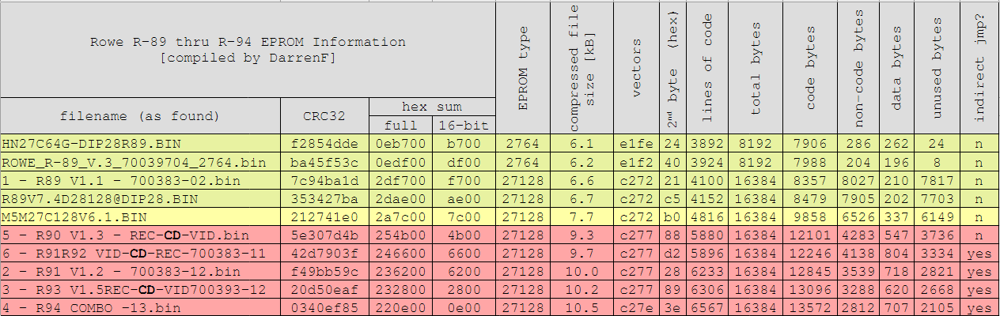

# EPROM Revisions

Thanks to several helpful and generous people on the International Arcade Museum forums (https://forums.arcade-museum.com/), I also have dumps of other EPROMs used on CCCs in the R-89 thru R-94 series.

This folder is an archive of them, until I have time to disassemble and compare code among versions, tracking changes, upgrades, bugfixes, etc.

If you have an EPROM dump from an R89-R94 CCC and would like to share it with me to help this project, please contact me via the Discussions for this repo.  If you have an such an EPROM and are not able to dump it, but are willing to mail to to me to be dumped (that just means copied off using an EPROM reading tool) please also contact me.  I will pay for return postage.

This collection is by no means complete.  I expect a number of other revisions are lurking in the wild.  However, I have tried to create a system to identify and organize these various revisions, since the printed EPROM labels do not seem to conform to any consistent system.  Below is a table, organized in what I believe is chronological order, based on the content and features of the EPROMs.

