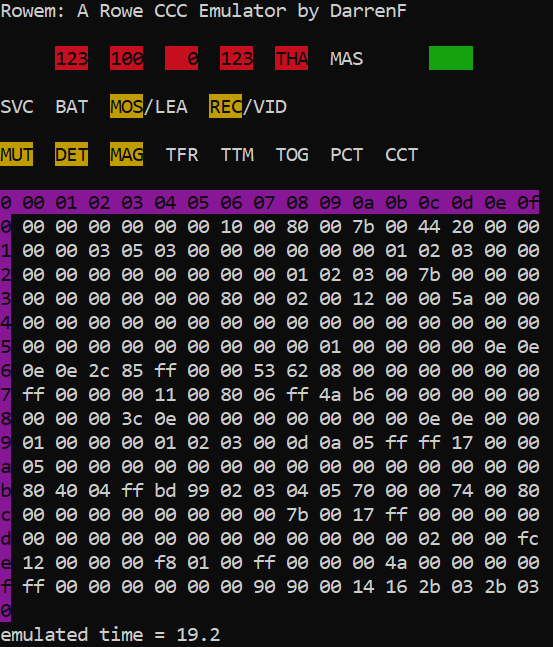

rowem: A Rowe CCC Emulator
==========================

_rowem_ is currently being developed in Windows 10.  However, only fairly basic console I/O are being used.  So porting it to a POSIX system probably wouldn't be too hard, for someone motivated to do so.  Might be easier to just use a Windows VM or maybe WINE, although I haven't tried either.

   

**Compiling:** I do not use a makefile for this simple program.  I compile rowem using MinGW (Minimalist GNU for Windows) simply using the command:

> gcc -O2 rowem.c -o rowem.exe

Note that rowem.c and fake6502.c should probably be in the current folder for that to work (and gcc should be in your path).

**Usage:**  There are no command line options supported.  Run rowem simply using:

> rowem

Note that rowem _requires_ there to be an 8kB or 16kB file named "rom.bin" in the same folder (there is currently no graceful error/warning if this is not found, or is the wrong size).  I use the EPROM dump "ROWE_R-89_V.3_70039704_2764.bin" (part of the repo) renamed "rom.bin" for this purpose; however any working Rowe CCC (8kB or 16kB) ROM should suffice.

_rowem_ will prompt you:
> Simulate loss of battery power (reset all RAM)?

You should answer:

> y

on the first run, as there will be no "ram.bin" file (it gets saves when exiting the emulator).  _rowem_ will next prompt:

>  Hold ADVANCE and RESET?

To which I recommend you respond:

>  y

At thta point, the emulator should boot up.  On subsequent runs (after properly exiting rowem, so that a "ram.bin" file gets created) you may answer "n" to the first prompt.  In that case, rowem will load the prior RAM contents from "ram.bin", and you may also answer "n" to the 2nd prompt.  This will simulate powering the jukebox on after being powered off (with a functional battery in the CCC).

The _rowem_ display consists of:
 - Top row: the (4) 3-digit LED 7-segment displays on the top of the jukebox, 
            the status (lit/unlit) of the "THANK YOU" (THA) and "MAKE A SELECTION" (MAS) lamps on the top of the jukebox,
            the 4-digit LED 7-segment displays on the CCC inside of the jukebox
 - 2nd row: the status of the service switch (SVC), the CCC battery (BAT), the "MOST/LEAST" (MOS/LEA) switch
            and the status of the "RECORDS/VIDEO" (REC/VID) switch, all on the CCC or under the cover of the jukebox.
 - 3rd row: the status of the MUTe signal, DETent solenoid, MAGazine motor, TransFeR motor, TurnTable Motor,
            TOGgle solenoid, Play CounTer solenoid, and Coin CounTer solenoid.
 - A table: showing one page (16 bytes x 16 bytes) of RAM in hexadecimal.
 - The approximate duration of emulated time.

The key bindings/controls of _rowem_ are:

    q = Quit emulator
    ! = reset 6502 CPU
    . = memory monitor, next page
    , = memory monitor, prev page
    c = coin 1 (nickel)
    v = coin 2 (dime)
    b = coin 3 (quarter)
    n = coin 4 (half-dollar)
    m = coin 5 (dollar bill)
    0-9 = keypad digits
    p = keypad POPULAR key
    r = keypad RESET key
    o = 0 + POPULAR keys (for entering programming mode)
    x = CANCEL button (on mech, back of juke, or remote box)
    a = ADVANCE button on CCC
    z = RESET button on CCC
    l = MOST/LEAST switch toggle on CCC
    t = RECORD/VIDEO switch toggle on CCC
    s = SERVICE/ON switch toggle under top of jukebox
    - = toggle battery low/normal level signal
    [space] = pause emulator
